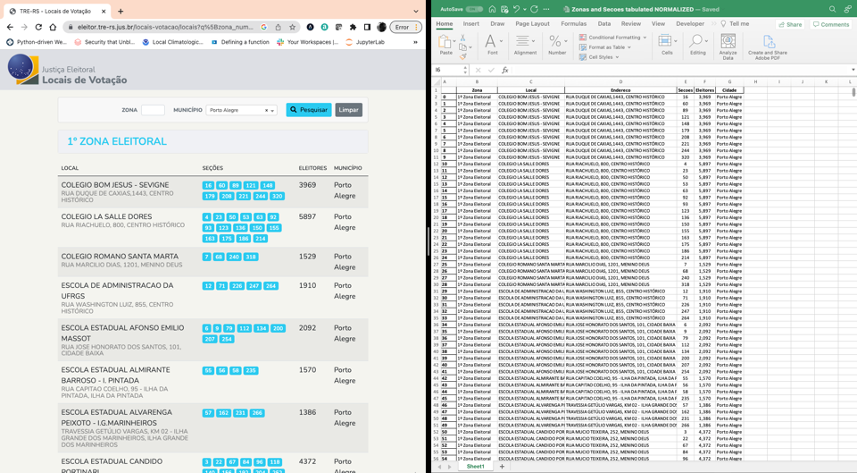

# TRE-RS Secoes and Zona Webscrapper

## Introduction

The purpose of this project is to help data analysts and data scientists to work with Brazilian electoral data.

Since the data on TRE-RS is only shown via web-pages, it is difficult to analyze electoral information in a geographical (spatial) way since the location of the votes are tied to the electoral sections and zones (Secoes and Zonas). I couldn't find an organized file to download in the website. If by any chance you know where to find, please, let me know. I will be happy the day this script is not needed anymore. :)

UPDATE ON OCT 29 - Added hability to process votes from Sao Paulo. This code is counting votes and percentages to the two main containders to this election: Jair Bolsonaro and Luiz Inacio "Lula" da Silva. But you can edit the code according to your necessity.

This script converts all the section and zones information into a tabular form that can be easily linked to the voting information so this geographical and spatial analysis can be done.

## How to use

I already saved the information for the city of Porto Alegre in the __Output folder__ within this repository.

To use this code the user must:

1) Execute the codes __1 Process Zonas Eleitorais_RS__ or __1 Process Zonas Eleitorais_SP__ depending on which city you want to analyse
2) Execute the code __2 Process Zonas Eleitorais Secoes Votos__ or __2 Votes NE__ 

## Expected updates

It is my intention to add a functionality into this code so it will scrap all the data from all the cities

## Limitations

This code works with the current version of the TRE-RS website, this site is changed regularly. In other states, each TRE makes this information available in different forms, so this scrapping script is __not expected to work__ with other state's TRE. I know that the State of SP offers this information already in a tabulated way, [check here](https://www.tre-sp.jus.br/eleitor/atendimento-online/titulo-e-local-de-votacao/consulta-por-zona-eleitoral-e-bairro)

## Technology and libraries

I used Python 9.3.13 to run this code with the following libraries installed:

* BeautifulSoup
* pandas
* urllib.request
* openpyxl
